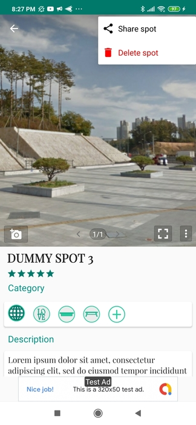

## Introduction
Welcome to SpotBook! This is an Android mobile app that has been under (intermittent) development since summer 2018. The goal of this app is to provide fellow skateboarders around the world with an easy way to save, search, and share their favorite places ("spots") to skateboard. An integral part of street skateboarding consists of finding spots (often with unique architecture) to skate. Skateboarders spend countless hours searching for new spots, deciding which spots to skate on a given day, and trying to find out about spots from others. Despite the significant role of spot searching, saving, and sharing, the ways that skateboarders currently resort to doing this are surprisingly primitive; most skateboarders have nothing more than a mental library of spots, remembering only vaguely the general vicinity of and layout of each spot. The more organized skaters may have some photos with geodata buried somewhere in their photo roll on their phone or embedded in a thread of a chat app. Consequently, returning to and sharing spots often is not always as easy as it could be.

<strong>* Note that this is the public landing page for the private repository SpotBook. This readme serves as an introduction to and overview of the app. If you would like to view the source code, please login to this GitHub account, potentialEmployer77, using the login credentials provided at the top of my resume. After logging in, you will have access to the private repository Skatespot-Organizer.</strong>

SpotBook is currently being beta tested via Google Firebase App Distribution and its release to the Google PlayStore is planned for early 2021. The beta version 0.1 is available for intial use and testing via the following Google Firebase App Distribution [invitation link](https://appdistribution.firebase.dev/i/bb56b9b6a06b649b). You will need to provide your email and then Firebase will send you an invitation walking you through the steps to download the app onto your Android device.

A video demo of the app as of October 2020 is available [here](https://youtu.be/jxqs0F_ICZM).

## Why SpotBook?
The motivation behind making this app comes from the observation that there is a shortage of good apps that allow skateboarders to organize and share spots in an easy way. While there are a few "spot apps" out there, most of the ones we've used suffer from one or more of the following problems:

 * Inability to keep spots private: While sharing is what happens to most spots after they are discovered, skateboarders often prefer to share certain spots with only a select few people. The reason is that spots can be become "busts" (non-skateable) if they become too popular. Therefore, while SpotBook allows users to share spots, it doesn't force them to. SpotBook users maintain private collections of spots but also have the option to share spots (in a user-controlled way) with their friends if they want to.

 * Spot search/retrieval functionality is limited: Some apps allow users to see all spots within a given radius of a specific city and/or their current location, or based on the spots' attributes (name, obstacles, etc.), however, we are yet to see an app that integrates all of these search options together in one app. Since spot search/retrieval will be a primary function of this app, we hope to make this task as powerful and user-friendly as possible.

 * Too general: General-purpose apps such as Google Maps aren't tailored (or configurable) enough to skateboarding's unique and specific requirements when it comes to saving, searching, and sharing spots. While it is possible to place and save makers and information on a map via these general-purpose map apps, it is often difficult to create collections of spots in a uniform way that would allow a skater to quickly access their saved spots and have all the spot info they want in a just a click or two. As for other special-purpose spot apps, many of these encompass multiple extreme spots and force these (often quite disparate) communities of users to share the same platform. This is nice if you are indeed a jack of all extreme sports, however, from our personal experience, we've seen that many users are really only interested in one sport, and would at least like to have the option of limiting the app to their particular sport of interest.

## Enter the SpotBook app...

The first version of the app focuses on providing four main pieces of functionality:

1). Spot saving: First and foremost, the user must be able to capture and save spots in the app. A spot consists of a spot name, location (geographical coordinates), rating (0-5 stars), category (flatground, bank, ledge, ramp, etc.), description, and associated media (photos and video).

&nbsp; &nbsp; &nbsp; &nbsp; &nbsp; &nbsp;&nbsp; &nbsp; &nbsp; &nbsp; &nbsp; &nbsp;&nbsp; &nbsp; &nbsp; &nbsp; &nbsp; &nbsp;&nbsp; &nbsp; &nbsp; &nbsp; &nbsp; &nbsp;&nbsp; &nbsp; &nbsp; &nbsp; &nbsp; &nbsp;&nbsp; &nbsp; &nbsp; &nbsp; &nbsp; &nbsp;&nbsp; &nbsp; &nbsp; &nbsp; &nbsp; &nbsp;&nbsp; &nbsp; &nbsp; &nbsp; &nbsp; &nbsp;

2). Spot searching: As a user's collection of spots grows, it becomes crucial that the user be able to find specific spots in their collection quickly and easily. This functionality is provided via a a search function and an advanced filter. The user can specify a filter criteria (search parameters based on the spot attributes) and find the spot(s) they are interested in viewing. While the filter is set, only those spots that match the filter criteria are shown to the user.

3). Spot sharing: Each spot may be sent to a user's contacts via the "share spot" menu option. Since each spot is saved on the user's device, the spot must first be uploaded to a server and a link to that spot data created and sent to a user's contact via a third-party messaging application. Spot sharing is implemented using Google Firebase services such as Storage, the Realtime Database, Cloud Functions, and Dynamic Links.
  
4). Spot viewing: SpotBook provides several different modes for viewing one's spots:

  * Map view: When in this viewing mode, the user will see a map displaying either all of their spots or the results of a search as highlighted map markers. The map also provides control buttons which allow the user to zoom in/out, zoom into their current location, and open the spot's location in Google Maps (in order to receive directions, etc.). Clicking on a marker pops an info window displaying more info about the spot (spot name, rating, main photo), and clicking the info window brings the user to the spot's detail view.
  
  &nbsp; &nbsp; &nbsp; &nbsp; &nbsp; &nbsp;&nbsp; &nbsp; &nbsp; &nbsp; &nbsp; &nbsp;&nbsp; &nbsp; &nbsp; &nbsp; &nbsp; &nbsp;&nbsp; &nbsp; &nbsp; &nbsp; &nbsp; &nbsp;

  * List view: This viewing mode allows the user to view either all of their spots or the results of a search in scrollable list format. Here, the user can quickly see the name, main photo, rating, and description of their spots. The user has the option to sort/order the list by various criteria including creation date, spot name, rating, and distance to a specified search location. The user can also quickly delete spots from the list by swiping. Clicking on a spot list item takes the user to the spot's detail view, where they can see all the spot's details.
  
  &nbsp; &nbsp; &nbsp; &nbsp; &nbsp; &nbsp;&nbsp; &nbsp; &nbsp; &nbsp; &nbsp; &nbsp;&nbsp; &nbsp; &nbsp; &nbsp; &nbsp; &nbsp;&nbsp; &nbsp; &nbsp; &nbsp; &nbsp; &nbsp;
  
  * Grid view: This viewing mode is very similar to the list view as it allows the user to view either all of their spots or the results of a search in scrollable  format. All functionality available in the list view is also available in this view. The only difference is that the spots are shown as cards in a grid instead of as list items in a list.
  
  
  
  * Detail view: When in this viewing mode, the user will be able to see all of the spot's details in unabbreviated form. This will include a gallery of media (photos and video), the spot name, rating, category, description, address, and location on a map. The user is able to edit a spot's details by clicking on the detail and making the desired change. A separate menu is provided over the media gallery to allow the user to edit, view details of, send, and delete each media item. Buttons are provided in the map that allow the user to see a street view of the spot's location, zoom in/out, and send the location to other Google Maps services. Lastly, from the overflow menu in the top right corner, the user can delete the spot and share the spot. 

